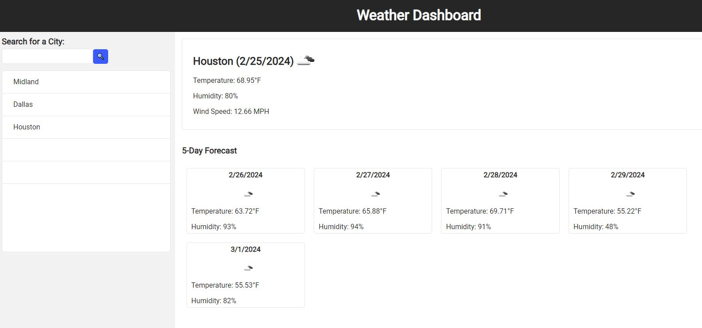

# Weather
Module 6 Challenge

## Description
This app was created for travelers to get the weather forecast for the next 5 days so they could plan their trips accordingly.

## Usage
To use this app, simply go to the following link:  
https://angiem07.github.io/Weather/ \
To search for a city enter a name into the search bar, then you'll be able to see the weather forecast for that city. Search cities will be saved to see the forecast when needed.

## Credits
References: \
https://elisesamanthadaly.github.io/06-Server-Side-APIs/ \
https://developer.mozilla.org/en-US/docs/Learn/Server-side/First_steps/Introduction \
https://openweathermap.org/forecast5 \

Debug:
ChatGPT

